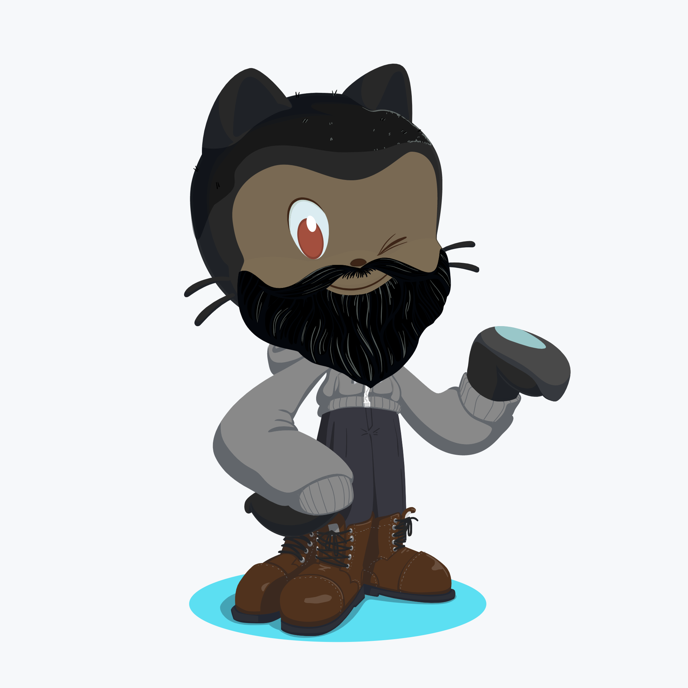

<!--
**EdersonDav/EdersonDav** is a ✨ _special_ ✨ repository because its `README.md` (this file) appears on your GitHub profile.

Here are some ideas to get you started:

- 🔭 I’m currently working on ...
- 🌱 I’m currently learning ...
- 👯 I’m looking to collaborate on ...
- 🤔 I’m looking for help with ...
- 💬 Ask me about ...
- 📫 How to reach me: ...
- 😄 Pronouns: ...
- ⚡ Fun fact: ...
-->

  

  

        
       
  

  <h3>Hello, I'm Ederson Davi! 👋</h3>
  
 👨🏿‍💻
  JavaScript | Node.js | ReactJS | HTML | CSS | Bootstrap | C# | SQL Server | MongoDB 
  

 
🌠I live in Suzano, São Paulo.

 
🖤 I love to learn about programming

 
🂠I'm 25 years old

 
💼 My goal is to work with the React stack and grow more and more as a developer

